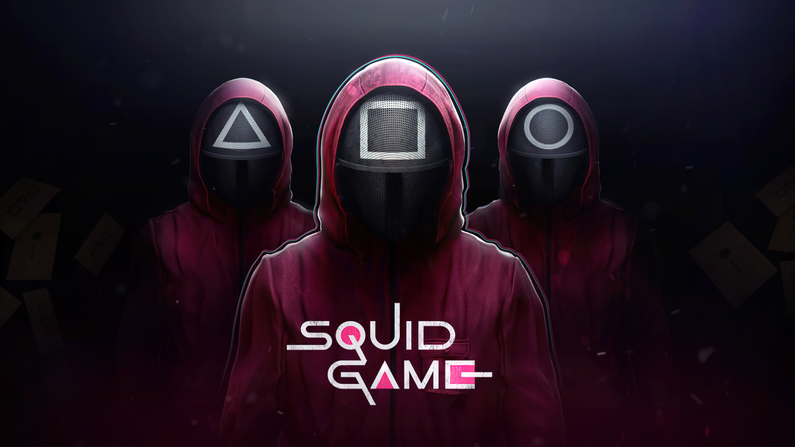

<h1 class="header-text">SQUID-GAME PROJECT</h1>

Made for personal education. Project that allows to watch the series of the tv-show with admin pannel which allow to add and remove any serie

The following stack of technologies used:

<ul class="list">
  <li class="list-item">React</li>
  <li class="list-item">Redux</li>
  <li class="list-item">SASS</li>
  <li class="list-item">React-Router</li>
  <li class="list-item">React-Icons</li>
</ul>

